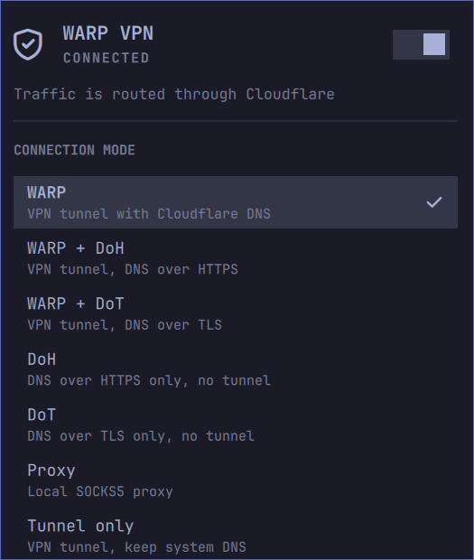

# WARP VPN — Omarchy bar widget

Cloudflare WARP for the Omarchy bar: see whether the tunnel is up, connect and
disconnect, and switch between WARP operation modes.



## Features

- Live tunnel state in the bar — shield-with-check when connected,
  circle-slash when not
- **Click the bar icon to open the panel.** That is the only click action;
  connecting and mode selection live inside the panel
- Connect / disconnect from a switch in the panel header
- Switch between the seven operation modes `warp-cli` supports
- Flush the DNS cache and republish NetworkManager's per-link DNS, so a
  tunnel change actually shows up in name resolution (asks for your password)
- Reports what `warp-cli` actually said, so a failure shows a reason instead
  of silently reading as "disconnected"
- Polls for changes made outside the panel (a `warp-cli connect` in a
  terminal, the daemon reconnecting on its own)
- Follows your theme: colours, fonts and spacing come from the Omarchy
  component kit, so it matches the built-in panels such as Bluetooth

## Keyboard shortcuts

Inside the panel:

| Key | Action |
| --- | --- |
| `j` / `k` or arrows | move cursor |
| `enter` / `space` | activate the current row |
| `c` | toggle the connection |
| `f` | flush the DNS cache |
| `tab` | switch to the next panel |
| `esc` | close |

## Operation modes

| Mode | What it does |
| --- | --- |
| `warp` | VPN tunnel with Cloudflare DNS |
| `warp+doh` | VPN tunnel, DNS over HTTPS |
| `warp+dot` | VPN tunnel, DNS over TLS |
| `doh` | DNS over HTTPS only, no tunnel |
| `dot` | DNS over TLS only, no tunnel |
| `proxy` | local SOCKS5 proxy |
| `tunnel_only` | VPN tunnel, keep system DNS |

The list is the set `warp-cli mode` accepts; the widget validates against it
locally and never sends an unknown mode.

## Requirements

- `warp-cli` on `PATH`, plus a running `warp-svc` — on Arch:
  `omarchy pkg aur add cloudflare-warp-minimal-bin`
- `jq` (already an Omarchy dependency)

No `sudo` and no `pkexec` prompt: the widget drives `warp-cli` as your user,
and the daemon does the privileged work. Connecting to a network and changing
modes both work unprivileged.

## Install

```bash
omarchy plugin add https://github.com/coreySean/omarchy-warp-vpn.git --enable
```

`--enable` adds it to the bar, prompting for a section (default: right). To
place it later:

```bash
omarchy bar move coreySean.warp-vpn --section right
```

## Configuration

Poll interval, in seconds (default `4`):

```bash
omarchy bar set coreySean.warp-vpn pollIntervalSec 10 --json
```

Lower it for a snappier icon, raise it if you would rather `warp-cli` be
called less often.

## Flushing DNS

Tunnelling changes which resolver answers, and NetworkManager keeps its own
per-link view of that. Flushing the cache alone can leave those link entries
stale, so **Flush DNS cache** does three things:

1. `resolvectl flush-caches`
2. `nmcli general reload dns-full`
3. `nmcli device reapply` on each connected Wi-Fi/Ethernet link (loopback and
   P2P are skipped)

It runs through `pkexec`, so the Omarchy polkit agent puts a **password prompt**
on screen and the whole refresh happens as one authenticated unit. The button
reads "Waiting for password…" until you answer.

Note that on many systems — including a default Omarchy install — every one of
those steps already succeeds unprivileged, so the prompt is not strictly
required. It is there because doing the NetworkManager republish as root is
reliable regardless of how polkit is configured.

### Why the privileged surface is so narrow

Plugins live in `~/.config/omarchy/plugins/`, which is **user-writable**. So
`pkexec` is never pointed at this repo's own files: that would hand root to
anything able to write there. Instead the widget runs
`pkexec /bin/sh -c '<a fixed literal>'`, with nothing interpolated into the
string and the link list discovered *inside* the root shell. The only thing
running as root is a DNS flush.

## Privacy

The widget shells out to `warp-cli` and reads its output. It stores no
credentials and reads none: WARP keeps your registration, account and device
identity in the root-owned `/var/lib/cloudflare-warp`, and this plugin never
touches it. Nothing about your account is sent anywhere by this code.

The DNS flush asks for your password through polkit, the same prompt Omarchy
already uses for its own privileged helpers. No password is stored, read or
transmitted by this plugin.

## How it works

- `warp-actions` — the backend. Calls `warp-cli --json`, normalises the result
  into a small `key=value` block on stdout, and reports failures as data
  (`ok=0` plus `error=...`) rather than as an empty stream.
- `Model.js` — pure parsing and formatting, no QML types.
- `Panel.qml` — the Omarchy `Panel`, `PanelHero`, `PanelKeyCatcher`,
  `CursorSurface` and `Style`/`Color` tokens.

One Quickshell detail worth knowing if you edit this: `Process.stdout` is
`null` on current Quickshell, so every process here captures its output with
an explicit `stdout: StdioCollector`. Without that the panel silently shows
nothing. Also note that saving a file under `~/.config/omarchy/plugins/`
triggers a plugin reload that does *not* recompile the QML — run
`omarchy restart shell` after editing.

## License

MIT
